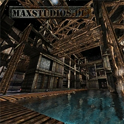

# Cube Bauhaus

**Standalone octree CSG geometry editor — build levels for any engine.**

Cube Bauhaus is a real-time octree geometry editor reimplemented in Rust/Vulkan, based on the legendary Cube2/Sauerbraten editing system. It runs as a standalone application and exports optimized meshes with textures to standard formats (GLB, FBX) for use in Unreal Engine, Unity, Godot, or any other game engine.

The Cube2 octree CSG system is one of the most elegant real-time geometry editing systems ever created. This project frees that technology from its original engine and makes it available to modern game development.

## Features

- **Real-time octree CSG editing** — fill, push, corner drag, copy/paste, undo/redo
- **Texture system** — slot cycling, rotate, scale, offset per face
- **Material support** — air, water, lava, clip, glass
- **Sauerbraten map loading** — reads OGZ v33 files with full texture loading from .cfg
- **OGZ save/load** — native format roundtrip with file dialogs
- **GLB export** — binary glTF 2.0 with embedded textures and PBR materials
- **FBX export** — ASCII FBX 7.4 with per-slot materials and texture references
- **Mesh optimization** — vertex deduplication, degenerate triangle removal, full interior face occlusion culling
- **Vulkan renderer** — GPU texture arrays, anisotropic filtering, dynamic rendering
- **egui overlay** — menu bar, status bar, mouse-driven UI via AltGr toggle

## Controls

| Key | Action |
|-----|--------|
| E | Toggle edit mode |
| WASD | Move camera |
| Mouse | Look (click to capture, Esc to release) |
| Scroll | Fill/push geometry |
| LMB/RMB | Select face / Select vertices |
| 1+Scroll | Cycle texture slot |
| 2+Scroll | Rotate texture |
| 3+Scroll | Scale texture |
| 4+Scroll | Offset texture (Shift = 2nd axis) |
| 5+Scroll | Cycle material |
| C / V | Copy / Paste |
| Z / I | Undo / Redo |
| X | Flip selection |
| Del | Delete selection |
| G+Scroll | Grid size |
| F | Toggle wireframe |
| Ctrl+S | Save OGZ |
| Ctrl+O | Open OGZ |
| Ctrl+N | New map |
| Ctrl+E | Export GLB |
| Ctrl+Shift+E | Export FBX |
| AltGr | Toggle UI mouse mode |

## Building

Requires Rust 1.75+ and the Vulkan SDK.

```bash
cargo build --release
```

## Usage

```bash
# Load a Sauerbraten map
cube-bauhaus path/to/map.ogz

# Start with empty map
cube-bauhaus
```

## Downloads

Maps and texture packs are hosted separately — **not included in this repo**.

Download from **[gamedev.tech/downloads/cube-bauhaus](https://gamedev.tech/downloads/cube-bauhaus/)**:

| Pack | Contents | Size |
|------|----------|------|
| **Maps Pack** | All BananaBread maps + Thor2009 (OGZ + .cfg) | 32 MB |
| **GK Texture Packs** | cyber, fantasy, future, lava, dds | 129 MB |

Extract into a `packages/` directory next to the executable:
```
cube-bauhaus/
  cube-bauhaus.exe
  packages/
    base/          ← maps (.ogz + .cfg)
    gk/            ← texture packs
```

### Thor2009



**Thor2009** by cronos (Gregor Koch, 2009) — an industrial underwater environment originally created for Sauerbraten and published on [Quadropolis](https://quadropolis.github.io/). Complete with custom textures, normal maps, specular maps, and architectural model kit.

## Architecture

```
cube-bauhaus/
  src/              # Application: editor state, input, main loop
  crates/
    cube-world/     # Pure geometry: octree, editing, serialize, export (no GPU deps)
    bbc-renderer/   # Vulkan renderer: pipelines, shaders, egui integration
```

The `cube-world` crate has zero renderer dependencies — it produces plain vertex/index arrays that any renderer can consume. This makes it reusable as a library for engine plugins.

## Heritage & Credits

Cube Bauhaus is built on the shoulders of one of the most influential geometry editing systems in game development history. This is an independent Rust reimplementation — no original C++ source code is included.

### The Creators

- **[Wouter van Oortmerssen (Lee)](http://strlen.com/)** — Creator of the Cube and Cube2/Sauerbraten engines. The octree CSG editing system he designed remains unmatched for real-time level editing. [[Personal site]](http://strlen.com/) [[Sauerbraten]](http://sauerbraten.org/) [[About Lee]](http://sauerbraten.org/lee/)
- **[Alon Zakai (kripken)](https://github.com/kripken)** — Creator of Emscripten and the [BananaBread](https://github.com/kripken/BananaBread) port, which proved Cube2 could run anywhere — even in a browser. His work on compiling C++ to JavaScript/WebGL was groundbreaking.
- **[Lee Salzman (lsalzman)](https://github.com/lsalzman)** — Creator of [Tesseract](http://tesseract.gg/), the modern rendering fork of Cube2 with deferred shading, dynamic global illumination, and HDR lighting.

### The Cube Engine Family

| Project | Description |
|---------|-------------|
| [Cube / Cube2: Sauerbraten](http://sauerbraten.org/) | The original — real-time octree CSG editing FPS engine |
| [Tesseract](http://tesseract.gg/) | Modern renderer fork — deferred shading, GI, HDR |
| [BananaBread](https://github.com/kripken/BananaBread) | Cube2 compiled to JavaScript/WebGL via Emscripten |
| [Red Eclipse](https://www.redeclipse.net/) | Free arena FPS built on the Cube2/Tesseract engine |
| [OctaForge](https://github.com/OctaForge) | Scripting-focused Tesseract fork |
| [Quadropolis (mirror)](https://quadropolis.github.io/) | Community map collection — thousands of user-created levels |
| [Sauerbraten SVN mirror](https://github.com/embeddedc/sauerbraten) | Git mirror of the official Sauerbraten source |

### Why this project exists

The Cube2 octree CSG system is one of the most elegant real-time geometry editing systems ever created. But it was always locked inside its own engine. Cube Bauhaus frees that technology — edit with the best CSG tools ever made, then export to Unreal, Unity, Godot, or any engine you want.

## License

MIT — see [LICENSE](LICENSE) for details.

The editor and export pipeline are free and open source. A commercial Unreal Engine plugin for real-time in-editor CSG editing is in development separately.
